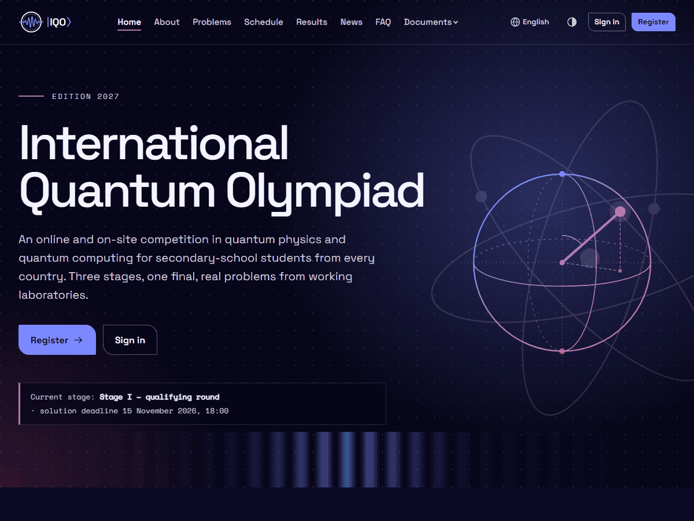

# IQO Quantum – motyw International Quantum Olympiad (1.1.0)

Paczka motywu w formacie THEME-01 (§ 1–3, § 1a) z rozszerzeniami THEME-02 (§ 2.1 `logos`/`fonts`,
§ 4 slot `nav`) dla [iqo-official.org](https://iqo-official.org). Ciemna domyślnie, z dopracowaną
paletą jasną – koordynator przełącza schemat (jasny / ciemny / systemowy) w „Dostosuj motyw”.



## Co się zmieniło względem 1.0.0

1.0.0 przemalowywała układ Olimpiady Kwantowej (dwa paski, pudełkowe sekcje, stopka z dwóch
pasów). 1.1.0 ma **własną kompozycję** – tożsamość międzynarodowej olimpiady naukowej:

| Element | 1.0.0 | 1.1.0 |
|---|---|---|
| Nagłówek | jeden pełny pasek, menu w drugim wierszu poniżej 1400 px | na stronie głównej **przezroczysty, leży na planszy**; logo \| menu wyśrodkowane \| konto; poniżej 1200 px menu za przyciskiem „Menu” (bez JS); konto zalogowanego zwinięte w rozwijane „Konto”; od 9 pozycji menu schodzi do własnego wiersza |
| Plansza | medal z paczką falową (gotowy SVG w kolorach marki) | **sfera Blocha + orbity + prążki interferencyjne** jako maski SVG barwione tokenami; tytuł w skali wystawowej (do 6,25 rem, rozstrzelenie −0,05 em); stan etapu jako pasek odczytu przyrządu |
| Sekcje | linia pod nagłówkiem, ornament \|Nagłówek⟩ | **pasy na całą szerokość okna** (co drugi w tle `band`), licznik `|01⟩` w kroju mono, nagłówek do 3,25 rem, hojny rytm (`space-section`) |
| Karty | półprzezroczyste, 2 narożniki | szkło + **4 narożniki wizjera**; aktualności z pasem prążków, cała karta klikalna, uniesienie przy najechaniu (bez ruchu przy `prefers-reduced-motion`) |
| Kroki | \|01⟩ w karcie | kolumny rozdzielone kreską, wielkie cienkie numery `01 02 03` |
| Oś czasu | karty | karty na wspólnej linii z węzłami (otwarty etap świeci akcentem) |
| Przyciski | pigułki | **kształt liścia** (dwa przeciwległe narożniki zaokrąglone, lustro w RTL), strzałka przy wezwaniu do działania |
| Tabele wyników | – | nagłówki kolumn jako etykiety mono, liczby w mono, miejsce w kolorze `cta`, wiersze nieprzezroczyste (przyklejone kolumny) |
| Nagłówek strony CMS | ornament przy `h1` | slot `page_header`: pas na całą szerokość z prążkami, etykieta `|Nazwa serwisu⟩`; strona ze spisem sekcji ma nagłówek nad spisem i tekstem |
| Stopka | dwa poziome pasy | **wielki znak słowny** (nazwa serwisu) z orbitami w tle, kolumny Serwis / Kontakt, taśma sponsorów nad stopką |
| Paleta jasna | nieużywana | pełnoprawna (sprawdzona zrzutami i kontrastem) |

## Zawartość

| Plik | Rola |
|---|---|
| `manifest.json` | schema 1, `iqo-quantum` **1.1.0**, `min_app_version` 0.41.0, `color_scheme: dark`, `layouts` (warianty niżej), `logos`, `fonts` |
| `tokens.json` | `colors` (paleta jasna), `dark` (ciemna, z własnymi `shadow-*`), `tokens` (kroje, skala, promienie, odstępy, cienie, `header-height`, `max-width`). Każdy klucz → `--t-<klucz>` |
| `theme.css` | jedyny arkusz: kroje, aliasy `--iqo-*` ← `--t-*`, most do ról `app.css` (panele), sloty, warianty układów, wysoki kontrast, forced-colors, druk |
| `templates/theme/header.html` | logo, przycisk „Menu”, ``, konto (role, forum, wiadomości, materiały, zgłoszenie, „Moja drużyna”, „Wyloguj”) |
| `templates/theme/nav.html` | slot `nav` – menu serwisu jako `<ul>`; grupy `<details class="nav-menu">`, `new_tab` → `target="_blank" rel="noopener noreferrer"`, `external` → ikona ↗ |
| `templates/theme/home_hero.html` | plansza (mechanika `data-hero-slider*` bez zmian) + warstwa rysunku `.iqo-hero__art` |
| `templates/theme/news_card.html` | karta na liście aktualności |
| `templates/theme/page_header.html` | nagłówek strony treści CMS |
| `templates/theme/footer.html` | stopka (te same msgid i `data-cookie-settings` co `base.html`) |
| `templates/theme/partials/logo.html` | wybór pliku logo (schemat, `theme.logo`, wariant na ciemne tło) |
| `assets/motifs/` | `bloch.svg`, `orbital.svg`, `fringes.svg` – czarne na przezroczystym, używane jako maski |
| `assets/icons/` | `menu`, `close`, `account`, `arrow`, `chevron` (24×24, maski barwione `currentColor`) |
| `assets/logo/` | logo „hybryda D”: lockup, znak, pełne logo (wersje na jasne i ciemne tło), favikona |
| `assets/fonts/` | Space Grotesk (oś `wght` 300–700) i Space Mono 400 – podzbiory woff2 + licencje OFL |
| `screenshot.png` | 1200×900, strona główna en, schemat ciemny |

Poza ZIP-em: `_preview/` (makiety i zrzuty), `tools/` (`make_motifs.py` – motywy i ikony,
`make_assets.py` – logo, `subset_fonts.py` – kroje), `build_zip.py`, ten plik.

## Opcje dla koordynatora

**Układy** (`layouts`, pierwszy = domyślny; rysuje je wyłącznie `theme.css` przez `data-layout-*`):

| Klucz | Warianty | Co robi |
|---|---|---|
| `header` | **`split`**, `centered` | `split`: logo \| menu \| konto w jednym wierszu; `centered`: logo na osi, konto na końcu, menu w osobnym wierszu pod nimi |
| `home_hero` | **`full-bleed`**, `split` | `full-bleed`: plansza na całą szerokość w kolorach `cover`, nagłówek na niej; `split`: dwie kolumny w kolorach palety (jasna w schemacie jasnym), rysunek w ramce przyrządu, pełny nagłówek |
| `footer` | **`columns`**, `compact` | `columns`: wielki znak słowny + kolumny z etykietami; `compact`: nazwa w rozmiarze tytułu, jeden pas odnośników |
| `cards` | **`outline`**, `elevated` | `outline`: szkło + narożniki wizjera; `elevated`: pełna powierzchnia, promień 16 px, miękki cień |

**Logo** (`logos` → `theme.logo`): `lockup` – poziomy lockup (znak + |IQO⟩, domyślny); `mark` – sam
znak i nazwa serwisu tekstem; `full` – pełne logo z napisem „International Quantum Olympiad”.
Nagłówek bierze plik według schematu efektywnego (`light` → plik na jasne tło, `dark` → na ciemne,
`auto` → `<picture>` z `prefers-color-scheme`), a na planszy i w trybie wysokiego kontrastu – zawsze
wariant na ciemne tło. Bez `theme.logo` – lockup z paczki.

**Kroje** (`fonts` → `--t-font-body/display/mono`; wyłącznie kroje z paczki + systemowe):
`grotesk` – Space Grotesk + Space Mono (domyślny, = `tokens.json`); `technical` – nagłówki Space Mono,
tekst Space Grotesk; `system` – tekst `system-ui`, nagłówki Space Grotesk, mono systemowe.
Dla ar, hi, bn, zh i ru krój pisma bierze się z sekcji 4 arkusza (kroje systemowe z glifami pisma).

**Kolory, które warto nadpisywać** (każdy klucz palety; arkusz czyta je wyłącznie przez `var(--t-…)`,
pochodne liczy `color-mix()`, więc nadpisanie przemalowuje także pasy, szkła i rysunki):

| Token | Gdzie widać |
|---|---|
| `bg`, `surface`, `surface-2` | tło strony (raster punktów), karty, pasy sekcji (`band` = `surface-2` 55 % + `bg`), panele list |
| `text`, `text-soft`, `muted` | tekst, akapity, etykiety i daty |
| `cta`, `cta-hover`, `cta-ink` | przyciski główne, numery kroków, narożniki kart, rysunek sfery (gradient `cta` → `accent`), miejsce w tabeli wyników |
| `accent`, `accent-contrast` | etykiety `|01⟩`, kreski aktywnych pozycji, otwarty etap, prążki (z `cta`) |
| `link`, `ring` | odnośniki; pierścień fokusu (≥ 3:1 na `bg` i `brand`) |
| `brand`, `brand-text` | pełny pasek nagłówka (strony poza planszą) |
| `cover`, `cover-text`, `cover-accent` | „okładki”: plansza `full-bleed`, stopka, dok osi czasu, baner cookies, nagłówek leżący na planszy (ciemne w obu schematach) |
| `primary`, `primary-contrast`, `primary-fill` | role aplikacji w panelach (pasek marki, przyciski `.btn--primary`) |
| `success`, `warning`, `danger`, `info` | odznaki i komunikaty |

## Decyzje projektowe

- **Okładki ciemne w obu schematach.** Rysunki (sfera, orbity, prążki) i wielki znak słowny są
  projektowane na ciemne tło; w schemacie jasnym `cover` to granat marki `#14123A`, strona jest
  jasna (`#F7F7FC`), pasy sekcji `#F1F2FB`, karty białe. Kto chce jasnej planszy – układ `split`.
- **Maski zamiast gotowych obrazów.** `assets/motifs/*` i `assets/icons/*` to czarne kształty;
  kolor nadaje tło z tokenów. Nadpisanie `cta`/`accent`/`cover-text` przemalowuje grafikę, tryb
  wysokiego kontrastu robi z niej żółć, `forced-colors` ją chowa (ikony dostają `CanvasText`).
  Ikona zawsze stoi przy napisie – brak maski (np. bucket bez CORS) usuwa rysunek, nie znaczenie.
- **Bez JavaScriptu.** „Menu” to pusty `<details>`, panel menu stoi **po nim** i pokazuje go
  `.iqo-menu[open] ~ .iqo-header__nav` – działa niezależnie od tego, jak przeglądarka chowa treść
  zamkniętego `<details>`. Grupy menu i „Konto” to zwykłe `<details>`.
- **Nakładka nagłówka** tylko wtedy, gdy plansza `full-bleed` jest pierwszym elementem `<main>`
  i nad treścią nie ma komunikatów (`.announcements`, `.messages`, pasek podglądu motywu) –
  `body:has(…)`. Bez `:has()` pasek jest pełny i stoi nad planszą (też poprawnie).
- **Strony publiczne vs panele.** Skala wystawowa, pasy i liczniki sekcji działają na stronach
  z nagłówkiem motywu (`body:has(> .iqo-header)`); panele (bez slotów) dostają tokeny, most ról
  i umiarkowaną skalę nagłówków.
- **Taśma sponsorów** w stopce (nad znakiem słownym): pod przezroczystym nagłówkiem nie ma
  miejsca. Fragment `cms/_sponsor_slider.html` sam sprawdza wpisy; pusty pas chowa `:has()`.
- **„Zgłoś problem” gościa** w nagłówku dopiero od 1440 px (ten sam odnośnik jest w stopce każdej
  strony); zalogowany ma go w „Koncie”.
- **Usunięte:** `assets/hero/wave-field.svg` (rysunek planszy 1.0.0).

## Dostępność – co sprawdzono

Kontrast (WCAG 2.x, wzór luminancji z `apps/themes/tokens.py`; pochodne `color-mix` policzone tak
samo jak w przeglądarce):

| Para | jasna | ciemna |
|---|---|---|
| `text` / `bg` | 16.7 | 17.8 |
| `text-soft` / `band` | 10.9 | 11.3 |
| `muted` / `surface-2` (najsłabszy tekst pomocniczy) | 6.2 | 7.4 |
| `link` / `bg` | 7.5 | 9.6 |
| `cta-ink` / `cta` (przycisk) | 5.8 | 6.3 |
| `accent-contrast` / `accent` | 5.9 | 7.2 |
| `accent` / `band` (etykiety `|01⟩`) | 5.3 | 6.6 |
| `brand-text` / `brand` (pasek) | 17.8 | 17.8 |
| `cover-text` / `cover` | 17.8 | 18.3 |
| tekst pomocniczy okładki (70 % `cover-text`) / `cover` | 9.1 | 9.0 |
| `cover-accent` / `cover` | 6.6 | 7.4 |
| `success` / `ok-soft` (odznaka) | 5.3 | 7.8 |
| `ring` / `bg` (fokus, próg 3:1) | 5.5 | 7.2 |

`cta` jako wypełnienie przycisku na `cover` w palecie jasnej – 3.1:1 (element nietekstowy; napis na
przycisku 5.8:1). Generator platformy nie zgłasza ostrzeżeń dla `dark`, `light` ani `auto`.

- Fokus: 2 px `ring` z odstępem 3 px; na okładkach `cover-accent`; karta aktualności rysuje fokus
  całej karty (`:has(a:focus-visible)`).
- `data-contrast="high"`: aliasy `--iqo-*` przestawione na czerń/biel/żółć (`#000`/`#fff`/`#ffe500`)
  – także plansza, stopka, karty, przyciski, menu, „Konto”, rysunki; bez poświat i rastrów; logo
  w wariancie na ciemne tło. Usunięcie atrybutu przywraca motyw (czysty CSS).
- `prefers-reduced-motion`: przejścia i uniesienie kart wyłącznie w `no-preference`.
- RTL: właściwości logiczne, lustrzane odbicie sfery, orbit, strzałek i poświat; licznik `|01⟩`
  zawsze LTR (zapis matematyczny). Zrzuty ar (strona główna, strona treści).
- Telefon 360 px: bez przewijania w bok (zrzuty en, ru z otwartym menu i „Kontem”); długie menu
  (ru, 11 pozycji) i wysokie pisma (hi) – zrzuty.
- `forced-colors` i wydruk – jak w 1.0.0 (rysunki znikają, okładki białe, pasy bez tła).

## Zależności od systemu motywów (`backend/apps/themes`)

1. Tokeny: `tokens.py` – przy `dark` do `:root` trafia paleta `dark`, przy `light` – `colors`, przy
   `auto` – obie (ciemna w `@media`). Arkusz nigdy nie ustawia `--t-*`.
2. Sloty dostają `theme.assets`, `theme.color_scheme` (schemat **efektywny**) i `theme.logo`
   (`{id, label, light, dark}` z pełnymi adresami albo `None`). Kontekst slotów: `safe_context.py`.
3. Slot `nav` (THEME-02 § 4) – `header.html` paczki dołącza `theme/nav.html` paczki; pozycje
   `cms_menu` z polami `key, title, url, children, active, home, new_tab, external`.
4. Taśma sponsorów stoi w stopce: `` (słownik z kontekstu motywu od
   THEME-02) + ``; reguła `:has()` w arkuszu zostaje zapasem.
5. Koordynator nadpisuje w panelu („Kolory i opcje motywu”) każdy kolor obu palet (także `cover`,
   `cover-text`, `cover-accent`; kontrast `cover-text`/`cover` i `cover-accent`/`cover` sprawdza
   platforma), promienie `radius-*` z `tokens.json` (m.in. `radius-leaf`, 0–48 px / 0–3 rem),
   schemat (`dark`/`light`/`auto`), logo (`logos`) i parę krojów (`fonts`). Wymiary `` logo
   wynikają z `theme.logo.id` (`lockup` 540×258, `mark` 280×280, `full` 610×298 –
   `templates/theme/partials/logo.html`).
6. Wgranie na produkcji: `docs/OPERACJE.md` § 30.7 (`theme_install - --activate iqo`).
7. Maski SVG i kroje z bucketu innego originu wymagają nagłówka CORS (`Access-Control-Allow-Origin`)
   – bez niego zostają kroje zapasowe, a rysunki i ikony znikają (napisy zostają).
8. `assets/` zawiera licencje `.txt` (OFL wymaga dołączenia; nie są publikowane).

## Budowanie i podgląd

```bash
python themes/iqo-quantum/build_zip.py        # → themes/iqo-quantum/dist/iqo-quantum-1.1.0.zip
```

Skrypt sprawdza lokalnie reguły walidatora (rozszerzenia, `url()`, `@import`, SVG, biblioteki tagów,
`|safe`, sloty z `nav`, `logos`/`fonts` manifestu) i pakuje tylko pliki formatu paczki.

```bash
uv run --no-project --with playwright python -m playwright install chromium
uv run --no-project --with playwright --with pillow python themes/iqo-quantum/_preview/render.py [katalog] [warianty…]
```

Odświeża `_preview/tokens*.css` (generatorem `apps/themes/tokens.py`), `_preview/index.html`,
`screenshot.png` i zapisuje zrzuty wariantów (jasny, układy alternatywne, strona treści z tabelą
wyników, lista aktualności, „Konto”, ar/RTL, ru, hi, wysoki kontrast, telefon z otwartym menu,
tablet, wydruk) do `_preview/shots/` (poza repozytorium). Makiety idą przez lokalny serwer HTTP
(maski SVG nie działają z `file://`). Grafiki: `tools/make_motifs.py`; logo: `tools/make_assets.py`.

## Licencje

- Space Grotesk – © 2020 The Space Grotesk Project Authors, SIL Open Font License 1.1
  (`assets/fonts/OFL.txt`).
- Space Mono – © 2016 The Space Mono Project Authors, SIL Open Font License 1.1
  (`assets/fonts/OFL-SpaceMono.txt`).
- Logo IQO i grafiki w `assets/` – znak International Quantum Olympiad; użycie wyłącznie w serwisie
  IQO. Kod paczki (CSS, szablony, skrypty) – licencja repozytorium.
